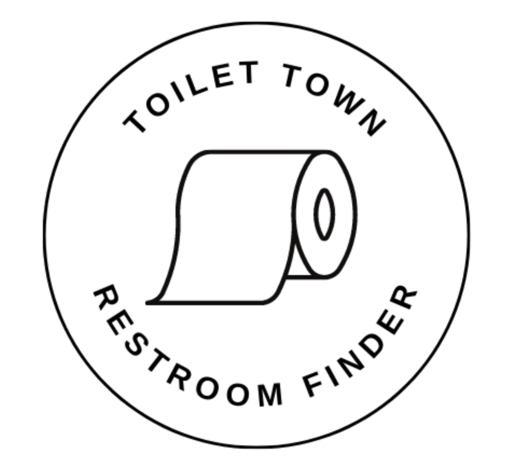

# ToiletTown - Your Guide to Clean and Safe Restrooms in Michigan's Big Cities

Submitted by: Juan Linares Orihuela as the final project for the Apple Foundations Program.

Welcome to ToiletTown, your go-to app for finding clean and safe restrooms in Michigan's bustling cities, with a special focus on metropolises like Detroit. Whether you're a local resident, a tourist exploring the city, a senior citizen in need of accessible facilities, or a family with kids on the go, ToiletTown is here to help you discover the best restrooms based on user ratings.

Time spent: Average of 3.0 hours for four days.

## Why Choose ToiletTown?

ToiletTown is designed to address the essential need for accessible and sanitary restroom facilities in densely populated urban areas. We understand the importance of finding a reliable restroom, especially when you're out and about. Here's why ToiletTown is the perfect solution:

- **Ease of Use:** Our user-friendly app is simple to navigate, ensuring that you can quickly locate the nearest clean restroom whenever the need arises.

- **Community-Driven Ratings:** We rely on the collective wisdom of the community to provide real-time ratings and reviews for restrooms. This means you can trust our recommendations, as they're based on the experiences of fellow users.

- **Coverage of Big Cities:** ToiletTown is specifically tailored to Michigan's major cities, such as Detroit. No matter where you are in the city, you can count on us to help you find a restroom nearby.

- **Accessibility Features:** We cater to the needs of all users, including seniors and those with mobility challenges, by highlighting accessible facilities and amenities.

## Key Features

### Find Restrooms Easily

[x] **Search Functionality:** Use our search feature to quickly locate restrooms in your vicinity or at a specific destination based on ZIP code.

[x] **Interactive iOS Maps:** Explore restroom options on an interactive map, making it easy to plan your route and find the most convenient facility.

### Community-Driven Ratings

[x] **User Reviews:** Read firsthand accounts of restroom experiences to make informed choices.

[x] **Rate and Review:** Share your own restroom experiences to contribute to our growing community of users.

### Accessibility Information

[x] **Accessibility Icons:** Look for easily recognizable icons indicating facilities that are wheelchair-friendly or equipped with changing stations.

### Personalized Recommendations

[x] **User Profiles:** Create a personal profile to save your favorite restroom locations and receive tailored recommendations based on your preferences.
 
## Video Walkthrough

Here's a walkthrough of implemented user stories:

Note: This section should be updated with the latest release information.

## Notes

Describe any challenges encountered while building the app.

· Learning all the required tools to build an Xcode app.
· Using Github and Git while working on the project.
· Make an interesting README page where people can understand the project.

Thank you for choosing ToiletTown – your trusted companion for clean and safe restrooms in Michigan's big cities.

## Join the ToiletTown Community

We believe in the power of community to make public restroom experiences better for everyone. Join us in our mission to provide reliable restroom information and improve the quality of life in Michigan's cities.
